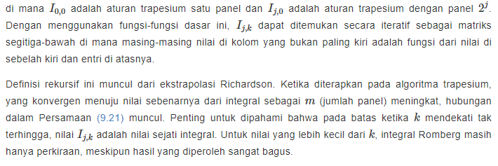
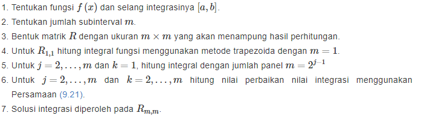

# Metode Integrasi Romberg

#### Pengertian

> Metode integrasi romberg didasarkan pada perluasan ekstrapolasi Richardson untuk memperoleh nilai integrasi yang semakin baik. Sebagai catatan , setiap penerapan ektrapolasi Richardson akan menaikan orde galat pada solusinya sebesar dua
> $$
> O(h^2N)---menjadi --- O(h^{2N+2})
> $$
> Seperti halnya algoritma integrasi adaptif, integrasi Romberg adalah perluasan yang relatif mudah dari keluarga algoritma Newton-Cotes. Keduanya bekerja dengan menggunakan iterasi yang disempurnakan dari beberapa metode Newton-Cotes yang mendasarinya untuk memberikan perkiraan nilai integral yang lebih akurat. Tidak seperti proses komputasi fungsi `riemann_adapint()`, integrasi Romberg bukanlah pendekatan adaptif terhadap integrasi. Hal tersebut berarti metode Romberg tidak mengubah perilakunya sendiri berdasarkan perilaku fungsi yang akan diintegrasikan. Sebaliknya, kita mengeksploitasi perilaku fungsi trapesium pada batas untuk menghasilkan estimasi integral. 
>
> Secara umum rumus integrasi dengan metode romberg adalah
> $$
> \begin{equation}
> I_{j,k}=\frac{4^k I_{j,k-1}-I_{j-1,k-1}}{4^k-1}
> \tag{9.21}
> \end{equation}
> $$
>
> 

###### Algoritma metode romberg



### Hasil code metode romberg


```python
import numpy as np
def trapezcomp(f, a, b, n):
    """
    Composite trapezoidal function integration

    INPUTS:
    f:  the function to integrate
    a:  lower bound of integration
    b:  upper bound
    n:  number of panels to create between ``a`` and ``b``
    """
    # Initialization
    h = (b - a) / n
    x = a

    # Composite rule
    In = f(a)
    for k in range(1, n):
        x = x + h
        In += 2*f(x)

    return (In + f(b))*h*0.5

def romberg(f, a, b, p):
    """
    Romberg integration

    INPUTS:
    f:  the function to integrate
    a:  lower bound of integration
    b:  upper bound
    p:  number of rows in the Romberg table
    """

    I = np.zeros((p, p))
    for k in range(0, p):
        # Composite trapezoidal rule for 2^k panels
        I[k, 0] = trapezcomp(f, a, b, 2**k)
        # Romberg recursive formula
        for j in range(0, k):
            I[k, j+1] = (4**(j+1) * I[k, j] - I[k-1, j]) / (4**(j+1) - 1)

        print(I[k, 0:k+1])   # display intermediate results

    return I
if __name__ == '__main__':
    def func(x):
        return np.sin(x)

    p_rows = 4
    I = romberg(func, 0, np.pi/2, p_rows)
    solution = I[p_rows-1, p_rows-1]
    print(solution)
```

###### hasil code

```
[0.78539816]
[0.94805945 1.00227988]
[0.9871158  1.00013458 0.99999157]
[0.99678517 1.0000083  0.99999988 1.00000001]
1.0000000081440203
```

-----------------------------------------------------------------------------------------------------------------------------------------------------------

<script type="text/x-mathjax-config">
MathJax.Hub.Config({
  tex2jax: {inlineMath: [['$$','$$']]}
});
</script>
  <script type="text/javascript" async
  src="https://cdn.mathjax.org/mathjax/latest/MathJax.js?config=TeX-MML-AM_CHTML">
</script>