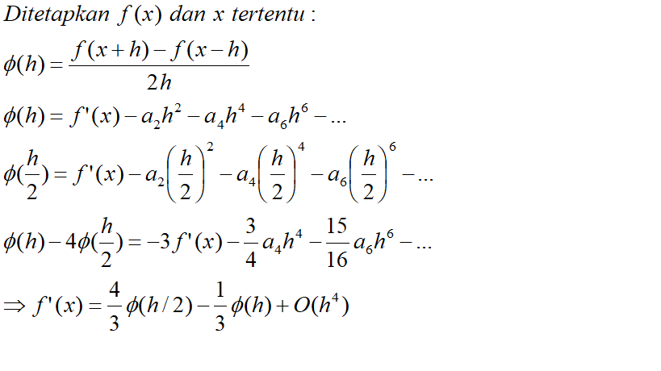

## Ekstrapolasi Richardson

**Ekstrapolasi Richardson** 

> Dalam analisis numerik, **ekstrapolasi Richardson** adalah metode percepatan urutan, yang digunakan untuk meningkatkan laju konvergensi suatu urutan.
>
> Ekstrapolasi Richardson adalah salah satu teknik menggabungkan dua nilai perkiraan yang dihitung diperoleh dengan menggunakan rumus yang sama atau metode dengan dua ukuran langkah yang berbeda, untuk mendapatkan metode orde tinggi yang menyediakan lebih dekat perkiraan jumlah tertentu.



### Penerapan Ekstrapolasi Richardson dalam Python

```python
from math import *
def Zero(n,m):
    Z=[]
    for i in range(n):
        Z.append([0]*m)
    return Z

def D(Func,a,h):
        return (Func(a+h)-Func(a-h))/(2*h)

def ekstrapolasi_richardson(func,a): 
    k=9 
    L=Zero(k,k)
    for I in range(k):
        L[I][0]=D(func,a,1/(2**(I+1)))
    for j in range(1,k):
        for i in range(k-j):
            L[i][j]=((4**(j))*L[i+1][j-1]-L[i][j-1])/(4**(j)-1)
    return L[0][k-1]
    
print('=====================  Richardson Extrapolation  ======================')
print('soal :\nf = -0.1*x**4-0.15*x**3-0.5*x**2-0.25*x+1.2 dengan x = 0.5')
print("=======================================================================")
print(ekstrapolasi_richardson(lambda x: -0.1*x**4-0.15*x**3-0.5*x**2-0.25*x+1.2 ,0.5))
print("=======================================================================")
print('diff(2**cos(pi+sin(x)) dengan x = pi/2 adalah = %04.20f'%ekstrapolasi_richardson(lambda x: 2**cos(pi+sin(x)),pi/3))


```

**hasil running program diatas yaitu**

```
=====================  Richardson Extrapolation  ======================
soal :
f = -0.1*x**4-0.15*x**3-0.5*x**2-0.25*x+1.2 dengan x = 0.5
=======================================================================
-0.9125000000000053
=======================================================================
diff(2**cos(pi+sin(x)) dengan x = pi/2 adalah = 0.16849558398154249050

```

<script type="text/x-mathjax-config">
MathJax.Hub.Config({
  tex2jax: {inlineMath: [['$$','$$']]}
});
</script>
  <script type="text/javascript" async
  src="https://cdn.mathjax.org/mathjax/latest/MathJax.js?config=TeX-MML-AM_CHTML">
</script>