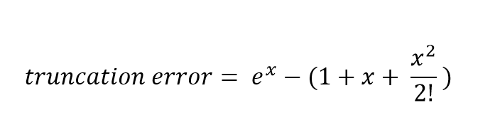
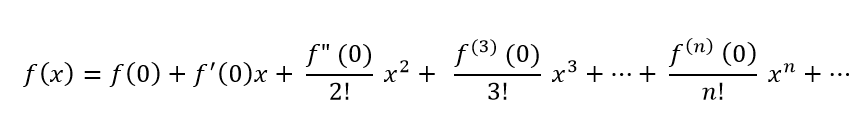

# Error in Numerical Computations

Nama		 : Yogi Widyanto

NIM			: 180411100049

## Materi 

1. ##### Error atau Galat

> Error / Galat merupakan perbedaan antara hasil penyelesaian suatu model matematik secara numeric dengan penyelesaian secara analitis. Kesalahan yang terjadi sangatlah penting, karena kesalahan dalam pemakaian algoritma pendekatan akan menyebabkan nilai kesalahan yang besar. Sehingga pendekatan metode numerik selalu membahas tingkat kesalahan dan tingkat kecepatan proses yang akan terjadi.

2. ##### Round of Error

> Perhitungan dengan metode numerik hampir selalu menggunakan bilangan riil. Masalah timbul bila komputasi numerik dikerjakan oleh mesin (dalam hal ini komputer) karena semua bilangan riil tidak dapat disajikan secara tepat di dalam komputer.  Sebagai contoh 1/6 = 0.166666666…

3. ##### Truncation Error

> Kesalahan pemotongan terjadi ketika suatu rumus komputasi disederhanakan dengan cara membuang suku yang berderajat tinggi.Metode numerik menggunakan pendekatan untuk menyelesaikan masalah. Kesalahan yang diperkenalkan oleh aproksimasi adalah kesalahan pemotongan. Rumus Truncation errors :
>
> 

4. ##### Deret Maclaurin 

> Deret Maclaurin sangat berguna dalam komputasi numerik dalam menghitung nilai - nilai fungsi yang susah dihitung secara manual. Contoh sin(x), cos(x), e^x

berikut algoritma mclaurin




Deret MacLaurin biasa disebut sebagai deret Taylor baku, kerena deret maclaurin merupakan standar atau dasar yang berlaku dengan a=0. Atau persamaan Deret MacLaurin diatas dapat ditulis seperti berikut
$$
f(x) = \sum \limits_{i=0}^{n}  {f^i(0)x^i \over i!}
$$


## Hasil Code

#### Berikut implementasi deret maclaurin

```python
import math
print("Soal  :  e^(3x)")
print(" ")
x = 1
var = 1
fa=1
kondisi = True
while kondisi==True :
    f=((3**var)*(x**var))/math.factorial(var)
    fnew=fa+f
    test=fnew-fa
    print("s",var,"=",fa)
    print("s",var+1 ,"=",fnew)
    print("selisih : ",test)
    print("--------------------------------------------------")
    if test <=0.0001 :
        break
    else :
        fa+=f
    var+=1
print("")
print ('total iterasi : ',var)
print ('untuk x =',x)
```

hasil dari program diatas

```
Soal  :  e^(3x)
 
s 1 = 1
s 2 = 4.0
selisih :  3.0
--------------------------------------------------
s 2 = 4.0
s 3 = 8.5
selisih :  4.5
--------------------------------------------------
s 3 = 8.5
s 4 = 13.0
selisih :  4.5
--------------------------------------------------
s 4 = 13.0
s 5 = 16.375
selisih :  3.375
--------------------------------------------------
s 5 = 16.375
s 6 = 18.4
selisih :  2.0249999999999986
--------------------------------------------------
s 6 = 18.4
s 7 = 19.412499999999998
selisih :  1.0124999999999993
--------------------------------------------------
s 7 = 19.412499999999998
s 8 = 19.846428571428568
selisih :  0.4339285714285701
--------------------------------------------------
s 8 = 19.846428571428568
s 9 = 20.009151785714284
selisih :  0.162723214285716
--------------------------------------------------
s 9 = 20.009151785714284
s 10 = 20.063392857142855
selisih :  0.05424107142857082
--------------------------------------------------
s 10 = 20.063392857142855
s 11 = 20.079665178571425
selisih :  0.016272321428569825
--------------------------------------------------
s 11 = 20.079665178571425
s 12 = 20.08410308441558
selisih :  0.004437905844156376
--------------------------------------------------
s 12 = 20.08410308441558
s 13 = 20.08521256087662
selisih :  0.001109476461039094
--------------------------------------------------
s 13 = 20.08521256087662
s 14 = 20.08546859390609
selisih :  0.0002560330294691937
--------------------------------------------------
s 14 = 20.08546859390609
s 15 = 20.08552345812669
selisih :  5.4864220601302804e-05
--------------------------------------------------

total iterasi :  14
untuk x = 1
```

##### Penjelasan

```python
import math						# import module math
print("Soal  :  e^(3x)")
print(" ")
x = 1							# nilai x
var = 1							# untuk jumlah iterasi dan juga pangkat
fa=1							# nilai f awal
kondisi = True					# kondisi awal untuk looping
while kondisi==True :			
    f=((3**var)*(x**var))/math.factorial(var)	# f=3^var*(x^var)/(var!) atau turunanya
    fnew=fa+f					# fnew untuk menjumlahkan fa dengan f selanjutnya
    test=fnew-fa				# mengetahui selisih
    print("s",var,"=",fa)
    print("s",var+1 ,"=",fnew)
    print("selisih : ",test)
    print("--------------------------------------------------")
    if test <=0.0001 :							# jika selisih <= 0.0001 maka break
        break
    else :
        fa+=f									# jika tidak fawal diganti f  
    var+=1										# var ditambah 1
print("")
print ('total iterasi : ',var)
print ('untuk x =',x)
```

<script type="text/x-mathjax-config">
MathJax.Hub.Config({
  tex2jax: {inlineMath: [['$$','$$']]}
});
</script>
  <script type="text/javascript" async
  src="https://cdn.mathjax.org/mathjax/latest/MathJax.js?config=TeX-MML-AM_CHTML">
</script>