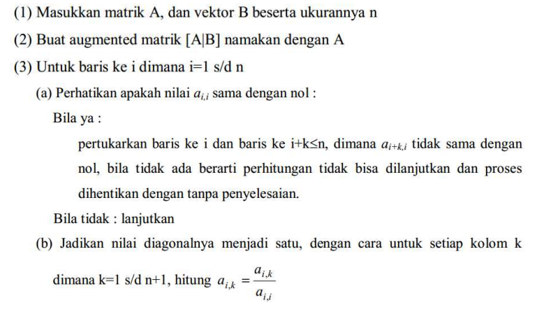
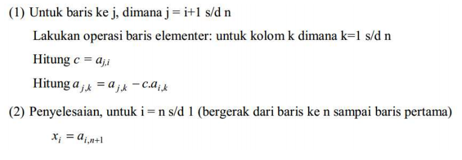
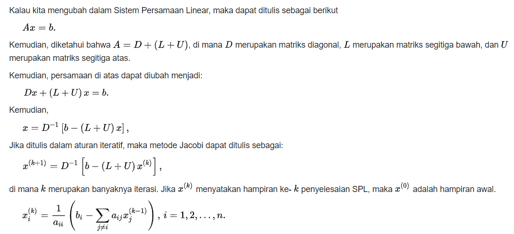
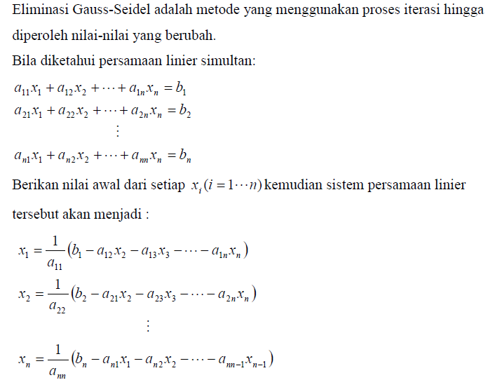

# Numerical Solution of System of Linear Algebraic Equations

### Eliminasi Gauss Jordan

> Eliminasi Gauss adalah suatu metode untuk mengoperasikan nilai-nilai di dalam matriks sehingga menjadi matriks yang lebih sederhana lagi. Dengan melakukan operasi baris sehingga matriks tersebut menjadi matriks yang baris. Ini dapat digunakan sebagai salah satu metode penyelesaian persamaan linear dengan menggunakan matriks. Caranya dengan mengubah persamaan linear tersebut ke dalam matriks teraugmentasi dan mengoperasikannya. Setelah menjadi matriks baris, lakukan substitusi balik untuk mendapatkan nilai dari variabel-variabel tersebut. 
>
> Metode Eliminasi Gauss Jordan merupakan pengembangan metode eliminasi gauss, hanya saja augmented matrik , pada sebelah kiri dirubah menjadi matrik diagonal.
>


## Algoritma Gauss Jordan





### Listing Program

```python
import numpy as np

#Definisi Matrix
A = []
B = []

n = int(input("Masukkan ukuran Matrix: "))
for i in range(n):
    baris=[]
    for i in range(n):
        a=int(input("Masukkan Nilai: "))
        baris.append(a)
    A.append(baris)
for i in range(n):
    h = int(input("Masukkan Hasil: "))
    B.append(h)

Matrix=np.array(A,float)
Hasil=np.array(B,float)

n=len(Matrix)


#Eliminasi Gauss

for k in range(0,n-1):
    for i in range(k+1,n):
        if Matrix[i,k]!=0 :
            lam=Matrix[i,k]/Matrix[k,k]
            Matrix[i,k:n]=Matrix[i,k:n]-(Matrix[k,k:n]*lam)
            Hasil[i]=Hasil[i]-(Hasil[k]*lam)

print("Matrix A : ",'\n',Matrix)

#Subtitution
x=np.zeros(n,float)
for m in range(n-1,-1,-1):
    x[m]=(Hasil[m]-np.dot(Matrix[m, m+1:n], x[m+1:n]))/Matrix[m,m]
    print('Nilai X ',m+1, '=',x[m])

```

Output:

```
Masukkan ukuran Matrix: 3
Masukkan Nilai: 2
Masukkan Nilai: -2
Masukkan Nilai: 5
Masukkan Nilai: 1
Masukkan Nilai: 5
Masukkan Nilai: 2
Masukkan Nilai: 4
Masukkan Nilai: 5
Masukkan Nilai: 2
Masukkan Hasil: 12
Masukkan Hasil: 3
Masukkan Hasil: -4
Matrix A :  
 [[ 2.   -2.    5.  ]
 [ 0.    6.   -0.5 ]
 [ 0.    0.   -7.25]]
Nilai X  3 = 3.2413793103448274
Nilai X  2 = -0.2298850574712644
Nilai X  1 = -2.333333333333332
```

jadi panjang Matrix yang dibuat dalam Program Diatas adalah 3 variabel.

|2  -2  5|  |12|

|1   5  2|=| 3 |

|4   5  2|   |-4|

pivot yang dibentuk adalah a1.1,a2.2,dan a3.3 sehingga semua angka yang ada dibawah pivot akan dikonversikan menjadi nol sesuai hasil program dan hasil dari persamaan diatas menghasilkan x1=-2.333333333, x2=-0.22988505 dan x3=3.2413793


### Eliminasi Gauss Jacobi

> **Metode Iterasi Jacobi** merupakan salah satu bidang analisis numerik yang digunakan untuk menyelesaikan permasalahan Persamaan Linier dan sering dijumpai dalam berbagai disiplin ilmu. Metode Iterasi Jacobi merupakan salah satu metode tak langsung, yaitu bermula dari suatu hampiran penyelesaian awal dan kemudian berusaha memperbaiki hampiran dalam tak berhingga namun langkah konvergen. Metode Iterasi Jacobi ini digunakan untuk menyelesaikan persamaan Linier berukuran besar dan proporsi koefisien nolnya besar.
>
> Metode ini ditemukan oleh Matematikawan yang berasal dari Jerman,Carl,Gustav,Jacobi. Penemuan ini diperkirakan pada tahun 1800-an.
>



### Listing Program

```python
from pprint import pprint
from numpy import array, zeros, diag, diagflat, dot
import numpy as np

def jacobi(A,b,N=25,x=None):
        #Membuat iniial guess                                                                                                                                                         
    if x is None:
        x = zeros(len(A[0]))

    #Membuat vektor dari elemen matrix A                                                                                                                                                                                                                                                                                                                 
    D = diag(A)
    R = A - diagflat(D)

    #Iterasi                                                                                                                                                                        
    for i in range(N):
        x = (b - dot(R,x)) / D
    return x

Mat1 = []
Mat2 = []

n = int(input("Masukkan ukuran Matrix: "))
for i in range(n):
    baris=[]
    for i in range(n):
        a=int(input("Masukkan Nilai: "))
        baris.append(a)
    Mat1.append(baris)
for i in range(n):
    h = int(input("Masukkan Hasil: "))
    Mat2.append(h)

A = array(Mat1,float)
b = array(Mat2,float)
x=len(Mat1)
guess = np.zeros(x,float)

sol = jacobi(A,b,N=25,x=guess)

print("A:")
pprint(A)

print("b:")
pprint(b)

print("x:")
pprint(sol)

```

Output:

```
Masukkan ukuran Matrix: 3
Masukkan Nilai: 3
Masukkan Nilai: 1
Masukkan Nilai: -1
Masukkan Nilai: 4
Masukkan Nilai: 7
Masukkan Nilai: -3
Masukkan Nilai: 2
Masukkan Nilai: -2
Masukkan Nilai: 5
Masukkan Hasil: 5
Masukkan Hasil: 20
Masukkan Hasil: 10
A:
array([[ 3.,  1., -1.],
       [ 4.,  7., -3.],
       [ 2., -2.,  5.]])
b:
array([ 5., 20., 10.])
x:
array([1.50602413, 3.13253016, 2.6506024 ])
```


### Program Gauss Seidel



### Listing Program

```python
def seidel(a, x ,b): 
	#Mencari Panjang Matrix	 
	n = len(a)				 
	for j in range(0, n):		 
		d = b[j]				 
		#Menghitung xi, yi, zi 
		for i in range(0, n):	 
			if(j != i): 
				d-=a[j][i] * x[i] 		 
		x[j] = d / a[j][j] #Solusi	 
	return x	 
				 
m=int(input("Masukkan Panjang Matrix: "))
a=[]
b=[]
for k in range(m):
    mat1=[]
    for i in range(m):
        l=float(input("Masukkan a"+str(k+1)+","+str(i+1)+": "))
        mat1.append(l)
    h=float(input("Masukkan Hasil: "))
    b.append(h)
    a.append(mat1)

n = 3							
x = [0, 0, 0]						 
print(x) 

for i in range(0, 100):			 
	x = seidel(a, x, b)
	print(x)				 

```

Output:

```
Masukkan Panjang Matrix: 3
Masukkan a1,1: 4
Masukkan a1,2: -1
Masukkan a1,3: 1
Masukkan Hasil: 7
Masukkan a2,1: 4
Masukkan a2,2: -8
Masukkan a2,3: 1
Masukkan Hasil: -21
Masukkan a3,1: -2
Masukkan a3,2: 1
Masukkan a3,3: 5
Masukkan Hasil: 15
[0, 0, 0]
[1.75, 3.5, 3.0]
[1.875, 3.9375, 2.9625]
[1.99375, 3.9921875, 2.9990625]
[1.99828125, 3.9990234375, 2.9995078125]
[1.99987890625, 3.9998779296875, 2.9999759765625003]
[1.99997548828125, 3.9999847412109375, 2.999993247070312]
[1.9999978735351562, 3.9999980926513667, 2.999999530883789]
[1.9999996404418945, 3.9999997615814205, 2.9999999038604734]
[1.9999999644302369, 3.9999999701976776, 2.9999999917325595]
[1.9999999946162794, 3.9999999962747097, 2.99999999859157]
[1.9999999994207849, 3.9999999995343387, 2.9999999998614464]
[1.9999999999182232, 3.999999999941793, 2.999999999978931]
[1.9999999999907154, 3.999999999992724, 2.9999999999977414]
[1.9999999999987457, 3.9999999999990905, 2.9999999999996803]
[1.9999999999998526, 3.9999999999998863, 2.9999999999999636]
[1.9999999999999807, 3.999999999999986, 2.999999999999995]
[1.9999999999999978, 3.9999999999999987, 2.9999999999999996]
[1.9999999999999996, 4.0, 3.0]
[2.0, 4.0, 3.0]
[2.0, 4.0, 3.0]
[2.0, 4.0, 3.0]
[2.0, 4.0, 3.0]
[2.0, 4.0, 3.0]
[2.0, 4.0, 3.0]
[2.0, 4.0, 3.0]
[2.0, 4.0, 3.0]
[2.0, 4.0, 3.0]
[2.0, 4.0, 3.0]
[2.0, 4.0, 3.0]
[2.0, 4.0, 3.0]
[2.0, 4.0, 3.0]
[2.0, 4.0, 3.0]
[2.0, 4.0, 3.0]
[2.0, 4.0, 3.0]
[2.0, 4.0, 3.0]
[2.0, 4.0, 3.0]
[2.0, 4.0, 3.0]
[2.0, 4.0, 3.0]
[2.0, 4.0, 3.0]
[2.0, 4.0, 3.0]
[2.0, 4.0, 3.0]
[2.0, 4.0, 3.0]
[2.0, 4.0, 3.0]
[2.0, 4.0, 3.0]
[2.0, 4.0, 3.0]
[2.0, 4.0, 3.0]
[2.0, 4.0, 3.0]
[2.0, 4.0, 3.0]
[2.0, 4.0, 3.0]
[2.0, 4.0, 3.0]
[2.0, 4.0, 3.0]
[2.0, 4.0, 3.0]
[2.0, 4.0, 3.0]
[2.0, 4.0, 3.0]
[2.0, 4.0, 3.0]
[2.0, 4.0, 3.0]
[2.0, 4.0, 3.0]
[2.0, 4.0, 3.0]
[2.0, 4.0, 3.0]
[2.0, 4.0, 3.0]
[2.0, 4.0, 3.0]
[2.0, 4.0, 3.0]
[2.0, 4.0, 3.0]
[2.0, 4.0, 3.0]
[2.0, 4.0, 3.0]
[2.0, 4.0, 3.0]
[2.0, 4.0, 3.0]
[2.0, 4.0, 3.0]
[2.0, 4.0, 3.0]
[2.0, 4.0, 3.0]
[2.0, 4.0, 3.0]
[2.0, 4.0, 3.0]
[2.0, 4.0, 3.0]
[2.0, 4.0, 3.0]
[2.0, 4.0, 3.0]
[2.0, 4.0, 3.0]
[2.0, 4.0, 3.0]
[2.0, 4.0, 3.0]
[2.0, 4.0, 3.0]
[2.0, 4.0, 3.0]
[2.0, 4.0, 3.0]
[2.0, 4.0, 3.0]
[2.0, 4.0, 3.0]
[2.0, 4.0, 3.0]
[2.0, 4.0, 3.0]
[2.0, 4.0, 3.0]
[2.0, 4.0, 3.0]
[2.0, 4.0, 3.0]
[2.0, 4.0, 3.0]
[2.0, 4.0, 3.0]
[2.0, 4.0, 3.0]
[2.0, 4.0, 3.0]
[2.0, 4.0, 3.0]
[2.0, 4.0, 3.0]
[2.0, 4.0, 3.0]
[2.0, 4.0, 3.0]
[2.0, 4.0, 3.0]
[2.0, 4.0, 3.0]
[2.0, 4.0, 3.0]
[2.0, 4.0, 3.0]
```

> Dari soal diatas persamaan yang dipilih adalah 4x-y+z=7, 4x-8y+z=-21 dan -2x+y+5z=15. Iterasi yang digunakan sebanyak 100 iterasi sehingga dapat menghasilkan x=2,y=4 dan z=3.
>